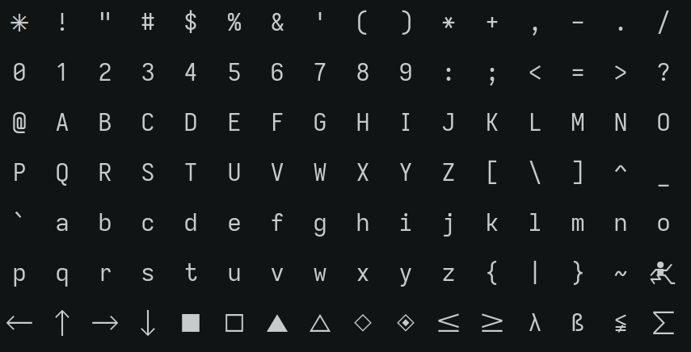

# Ramsevka

Ramsevka is my custom [Iosevka] build, packaged with Nix.

| Preview                              |
| ------------------------------------ |
|  |

## Building

This flake provides **4 packages** corresponding to different versions of the
same font. The main variants of Ramsevka are:

- Ramsevka Mono
- Ramsevka Term
- Ramsevka Mono Nerdfont
- Ramsevka Term Nerdfont

You may build any available variant with `nix build`. You may also call
`./nix/ramsevka-base.nix` yourself if you'd like to apply your own tweaks in
addition to what is available.

```bash
# Build directly from a checkout
$ nix build .#ramsevka-mono -Lv
```

## Installing

[GitHub Releases]: https://github.com/ramblurr/iosevka-custom/releases

Nix users may access to the packages provided by the flake, as described in the
[building section](#building). This will cause the font to be built from source.
There is no functional binary cache, so this will take a bit of time and consume
a lot of resources.

Built packages are provided in the [GitHub Releases] tab, and get updated each
time a new tag is provided. This can be used by Nix users who simply want to
avoid building, or non-Nix users that cannot afford a proper package manager on
their system.

### With Nix

You'll probably install this as a part of your system configuration. In most
cases it'll be enough to add this to your `config.fonts.packages` and then use
the correct font name (as listed by `fontconfig`) in the application you want to
use Ramsevka in. Some applications require font _files_, so you might need to
pass the full font path to those:

```nix
let
  ramsevka = inputs.ramsevka.packages.${pkgs.hostPlatform.system}.ramsevka-term;
in {
  someConfig = ''
    fontPath = ${ramsevka}/share/fonts/truetype/RamsevkaTerm-Bold.ttf
  '';
}
```

To use fontconfig, you may refer to the font directly. For example, using the
Foot terminal:

```nix
{
  settings = {
    main.font = "RamsevkaMono Nerd Font:size=15";
  };
}
```

## Credits

The Nix build scripts and repository structure used here were adapted from
[Ioshelfka] by [@NotAShelf]. Which was in turn inspired by [@viperML]'s [custom
Iosevka build].

Additionally, the [Iosevka customizer](https://typeof.net/Iosevka/customizer)
and the [build guide] from the upstream Iosevka repository have been valuable
references.

## License: MIT License

- Copyright © 2025 NotAShelf
- Copyright © 2026 Casey Link <unnamedrambler@gmail.com>

Distributed under the [MIT](https://spdx.org/licenses/MIT.html) license.

[Iosevka]: https://typeof.net/Iosevka
[Ioshelfka]: https://github.com/NotAShelf/Ioshelfka
[@viperML]: https://github.com/viperML
[custom Iosevka build]: https://github.com/viperML/iosevka/
[build guide]: https://github.com/be5invis/Iosevka/blob/main/doc/custom-build.md
[@NotAShelf]: https://github.com/NotAShelf
